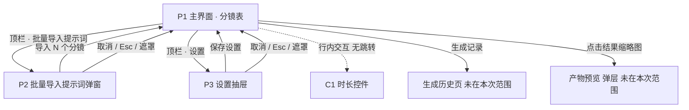
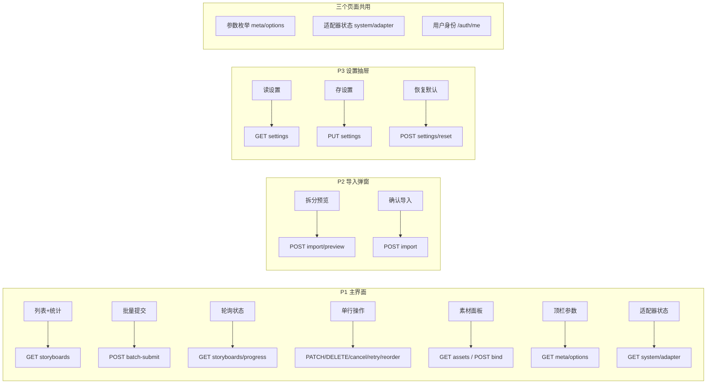

# 即梦批量视频生成控制台 · 前端页面与接口对接说明

> 状态：现行（接口契约；接口计数以 `server/routes.js` 为准）
> 权威范围：页面清单、数据模型逐字段、逐页说明、接口汇总、轮询语义、错误码
> 最新流程见：`docs/项目全面审查与改进流程.md`

| 项目 | 内容 |
|---|---|
| 文档版本 | v1.0 |
| 对应设计稿 | `即梦批量生成控制台 · 时长可控版`（Ardot fileId `726827865365067`）<br>历史版本：`…段落任务表版`（`726824176792019`）、三栏版（`726821120739113`） |
| 阅读对象 | 后端接口设计 / 前端对接 / 联调测试 |
| 交付范围 | 3 个页面 + 1 个交互组件；共 **30 条路由**（含 1 个轮询接口；2026-09-18 实测计数） |
| 术语 | **分镜**＝一次视频生成任务的最小单元（英文统一用 `storyboard`）；**素材**＝角色/场景/道具/首帧图/分镜图等参考资产（`asset`） |

> **本文档的用途**：后端可据此直接定接口，前端可据此搭骨架。所有字段名、枚举值、状态机以本文档为准；视觉样式以设计稿为准。

---

## 0. 通用约定

### 0.1 请求约定

| 项 | 约定 |
|---|---|
| Base URL | `/api/v1` |
| 认证 | `Authorization: Bearer <token>`，401 时前端跳登录 |
| 内容类型 | `application/json; charset=utf-8`（上传接口除外） |
| 时间格式 | ISO 8601 带时区，如 `2026-09-17T10:12:03+08:00` |
| ID 命名 | 前端不解析 ID 结构，一律当不透明字符串。建议前缀：分镜 `st_`、素材 `as_`、项目 `pj_`、批次 `bt_`；即梦侧远端 ID `jm_` |
| 分页 | `page`（从 1 开始）+ `pageSize`（默认 20，上限 100） |
| 幂等 | 所有 `POST` 写操作支持 `Idempotency-Key` 请求头，用于防重复提交 |

### 0.2 统一响应信封

```jsonc
{
  "code": 0,              // 0 = 成功；非 0 = 业务错误
  "message": "ok",        // 面向开发者的简短描述
  "data": { },            // 业务数据，错误时为 null
  "traceId": "a1b2c3d4"   // 链路追踪，前端错误提示可展示末尾 8 位
}
```

HTTP 状态码只表达传输层语义（200/400/401/403/404/429/500），**业务成败看 `code`**。

### 0.3 错误码表

| code | 含义 | 前端表现 |
|---|---|---|
| `0` | 成功 | — |
| `40001` | 参数校验失败（`data` 带 `fields`） | 表单行内红字 |
| `40100` | 未登录 / token 失效 | 跳登录页 |
| `40300` | 无权限 | 全屏提示 |
| `40400` | 资源不存在 | 列表内该行提示「已删除」并移除 |
| `40900` | 状态冲突（如已完成分镜不可改时长） | Toast + 回滚乐观更新 |
| `42900` | 请求过频 | 轮询自动退避，不打扰用户 |
| `50000` | 服务内部错误 | Toast「服务异常，请重试」 |
| `51001` | 即梦 CLI 不可用 / 未桥接 | 顶栏适配器变红，任务入队但不执行 |
| `51002` | 积分不足 | 该行状态置失败，操作区出「重试」 |
| `51003` | 内容审核未通过 | 该行标记失败，提示改写提示词 |
| `51004` | 上游生成超时 | 自动重试（若开启），超次数后置失败 |
| `51005` | 上游任务被中断 | 同上 |

### 0.4 前端通用状态规范

每个数据区块**必须**实现四态，后端需保证可区分：

| 状态 | 触发 | 前端表现 |
|---|---|---|
| 加载中 Skeleton | 首次请求未返回 | 骨架屏（表格显示 3 行灰条），**不显示空态** |
| 空态 Empty | 请求成功且集合为空 | 插画 + 一句引导文案 + 主行动按钮 |
| 错误态 Error | `code != 0` 或网络失败 | 错误占位 + 「重试」按钮，保留上次成功数据 |
| 无权限/未开通 | `40300` / `51001` | 顶部横幅警示，功能按钮置灰但可点开说明 |

**刷新策略**：列表类接口带 `ETag` / `If-None-Match` 时前端走 304 短路；不做本地持久化缓存（数据强实时）。

---

## 1. 页面清单与定位

| 页面 | 名称 | 功能定位 | 打开方式 | 关键能力 |
|---|---|---|---|---|
| **P1** | 主界面 · 分镜表 | 产品的**主工作台**。以表格形式承载一个批次下的全部分镜，展示提示词、素材绑定、进度与结果，并完成增删改、批量提交、状态跟踪 | 默认打开 | 表格 CRUD、批量提交、进度轮询、结果预览 |
| **P2** | 批量导入提示词 · 弹窗 | 把一段或多段提示词按**分隔符**批量拆成多个分镜，一次性落库 | P1 顶栏「批量导入提示词」 | 分隔符拆分、实时预览、按默认参数批量创建 |
| **P3** | 设置面板 · 抽屉 | 配置全局偏好：提示词分隔符、生成参数默认值、队列策略、接口模式 | P1 顶栏「设置」 | 配置读写、恢复默认 |
| **C1** | 时长控件 | 非独立页面。行内步进器，控制单个分镜的生成时长；支持直接输入、预设下拉、批量应用 | 嵌在 P1 表格行内 | 单值调整、批量应用 |

> **不设独立页面的原因**：导入与设置都是**轻量、低频、上下文强相关**的操作，做成弹窗/抽屉可以保留主表格的上下文（用户导入后立刻想看到新行）。后端不需要为它们设计独立的路由或权限。

---

## 2. 页面流转与依赖关系

### 2.1 页面跳转关系



- P2 / P3 关闭后**不整页刷新**，由前端局部更新（导入返回 `created[]` 直接插表；设置保存后按需重取受影响数据）。
- 从 P2 导入成功后，新行插入表格顶部并**自动勾选**，方便用户直接「批量提交」。
- P3 保存后需失效的缓存：`meta/options`（参数枚举可能变）、`settings`。

### 2.2 页面 → 接口依赖总览



### 2.3 关键时序：导入 → 拆分 → 提交 → 轮询 → 完成

```mermaid
sequenceDiagram
    participant U as 用户
    participant FE as 前端
    participant BE as 后端
    participant CLI as 即梦 CLI 桥接

    U->>FE: 粘贴文本，选择分隔符「;;」
    FE->>BE: POST /storyboards/import/preview
    BE-->>FE: segments[] 拆分结果 + 重复检测
    FE-->>U: 展示「已识别 3 段」+ 预览列表
    U->>FE: 点击「导入 3 个分镜」
    FE->>BE: POST /storyboards/import
    BE-->>FE: created[3]，状态 queued
    FE-->>U: 新行插入并勾选

    U->>FE: 点击「批量提交」
    FE->>BE: POST /storyboards/batch-submit {ids}
    BE->>CLI: spawn jimeng video create ...
    BE-->>FE: accepted[] / rejected[]
    FE-->>U: 立即进入轮询

    loop 每 3s（可退避到 10s）
        FE->>BE: GET /storyboards/progress?ids=...
        BE-->>FE: [{id,status,progress,etaSeconds}]
        FE-->>U: 更新进度条与 ETA
    end

    BE->>CLI: 任务完成
    FE->>BE: 下一次轮询
    BE-->>FE: status=succeeded, videoUrl, coverUrl
    FE-->>U: 结果缩略图可点，进度条转绿
```

---

## 3. 数据模型

### 3.1 Storyboard（分镜）· 核心实体

| 字段 | 类型 | 必填 | 说明 |
|---|---|---|---|
| `id` | string | 是 | 分镜 ID，`st_` 前缀 |
| `projectId` | string | 是 | 所属项目 |
| `batchId` | string | 是 | 所属批次（顶栏「第 1 批」） |
| `seq` | int | 是 | 批次内序号，从 1 开始，决定表格行序与「分镜 N」显示 |
| `prompt` | string | 是 | 提示词正文，1–2000 字 |
| `negativePrompt` | string | 否 | 负面提示词 |
| `durationSec` | int | 是 | **生成时长（秒）**，范围见 `meta/options` |
| `model` | enum | 是 | 取值来自 `GET /meta/options` 的 `models[].value`（2026-09-18 画布 CLI 移除后，可用模型 = 创作 CLI 支持集）：`seedance2.0` / `seedance2.0fast` / `seedance2.0_vip` / `seedance2.0fast_vip` / `seedance2.0mini` / `seedance2.5`。**引擎无需用户选择（只有创作 CLI 一个引擎）**。历史画布域名（`seedance_2.0_vip` 等）会被自动迁移为创作等价名 |
| `ratio` | enum | 是 | `16:9` / `9:16` / `1:1` / `4:3` / `21:9` |
| `resolution` | enum | 是 | `480p` / `720p` / `1080p` |
| `seed` | string \| int | 否 | `"random"` 或具体整数 |
| `motion` | float | 否 | 运动强度，`0.0`–`1.0`，两位小数 |
| `status` | enum | 是 | `queued` / `generating` / `succeeded` / `failed` / `canceled` |
| `progress` | int | 是 | 0–100。`queued` 恒为 0，`succeeded` 恒为 100 |
| `etaSeconds` | int \| null | 否 | 预计剩余秒数，仅 `generating` 有值 |
| `remoteId` | string \| null | 否 | 即梦侧任务 ID，`jm_` 前缀，未提交时为 null |
| `videoUrl` | string \| null | 否 | 成片地址，`succeeded` 时必有 |
| `coverUrl` | string \| null | 否 | 成片封面图 |
| `currentFrameUrl` | string \| null | 否 | 生成中预览帧（可选，用于进度缩略图） |
| `elapsedMs` | int \| null | 否 | 实际生成耗时，`succeeded`/`failed` 有值 |
| `retryCount` | int | 是 | 已重试次数 |
| `errorCode` | string \| null | 否 | 见 0.3 错误码表，如 `"51002"` |
| `errorMessage` | string \| null | 否 | 面向用户的失败原因 |
| `assets` | AssetRef[] | 是 | 已绑定素材，见 3.2 |
| `createdAt` | datetime | 是 | — |
| `startedAt` | datetime \| null | 否 | 开始生成时间 |
| `finishedAt` | datetime \| null | 否 | 结束时间 |
| `canEditDuration` | bool | 是 | **服务端裁决**是否允许改时长（见 8.2 待确认项） |

**AssetRef（分镜上的素材绑定）**

| 字段 | 类型 | 说明 |
|---|---|---|
| `assetId` | string | 素材 ID |
| `role` | enum | `character` / `scene` / `prop` / `firstFrame` / `storyboard` / `output` |
| `name` | string | 展示名，如「林彻」 |
| `thumbUrl` | string | 缩略图，表格单元格直接用这个 |
| `url` | string | 原图地址 |

> **表格列与 `role` 的映射**：`角色`列取所有 `role=character`（最多展示 2 个 + 一个「＋」槽）；`场景`/`道具` 各取 1 个；`首帧图`/`分镜图` 各取 1 个；`结果与进度`列取 `role=output`。
> **「＋」槽位的含义**：该 role 尚可追加。**多值槽位 = `character` / `prop`**（后端 `ROLE_MULTI` 为准），其余 role 各 1 个。
> **已绑定的素材格可点击**（2026-09-20 起）：点开是「素材预览」弹窗（原图 + 全屏 + 名称/类型·槽位/图号），并提供「替换素材」（只改本分镜）与「更换文件」（改素材本身）两个入口 —— 单值槽位绑上后 `＋` 会消失，这里是它唯一的换绑入口。`×` 仍是「移除」：委托处理器里 `data-unbind` 分支排在 `data-bound` 之前。

### 3.2 Asset（素材）

| 字段 | 类型 | 必填 | 说明 |
|---|---|---|---|
| `id` | string | 是 | `as_` 前缀 |
| `projectId` | string | 是 | — |
| `name` | string | 是 | 展示名，如「林彻」「雨夜街道」 |
| `type` | enum | 是 | `character` / `scene` / `prop` / `audio`（2026-09-18 新增音频类型；audio 的 thumbUrl 为 null，前端以音符图标+渐变显示） |
| `url` | string | 是 | 原图 |
| `thumbUrl` | string | 是 | 缩略图 |
| `width` / `height` | int | 是 | 像素尺寸 |
| `tags` | string[] | 否 | 自由标签 |
| `prompt` | string | 否 | 文生图提示词（上限 10000 字）。生图功能的提示词来源；分镜侧只读回声 |
| `inCurrentShot` | bool | 是 | 是否已被**当前选中分镜**引用（决定面板里是否显示对勾） |

### 3.3 枚举与选项（`meta/options`）

后端需用一个接口下发所有枚举，**前端不硬编码**：

```jsonc
{
  "code": 0,
  "data": {
    "models": [
      // 每个模型自带 resolutions / ratios / duration —— 前端据此动态过滤下拉项（2026-09-18）
      { "value": "seedance2.0",         "label": "Seedance 2.0",          "engines": ["dreamina"], "group": "dreamina", "enabled": true },
        "resolutions": ["720p","1080p","4k"], "duration": { "min": 4, "max": 15, "step": 1 } },
      { "value": "seedance2.0fast",     "label": "Seedance 2.0 Fast",     "engines": ["dreamina"], "group": "dreamina", "enabled": true },
        "resolutions": ["720p"] },
      { "value": "seedance2.0_vip",     "label": "Seedance 2.0 VIP",      "engines": ["dreamina"], "group": "dreamina", "enabled": true },
        "resolutions": ["720p"] },
      { "value": "seedance2.0fast_vip", "label": "Seedance 2.0 Fast VIP", "engines": ["dreamina"], "group": "dreamina", "enabled": true },
        "resolutions": ["480p","720p","1080p"], "duration": { "min": 4, "max": 30, "step": 1 } },
      { "value": "seedance2.0mini",     "label": "Seedance 2.0 Mini",     "engines": ["dreamina"], "group": "dreamina", "enabled": true },
        "resolutions": ["720P","1080P"] },
      { "value": "seedance2.5",         "label": "Seedance 2.5",          "engines": ["dreamina"], "group": "dreamina", "enabled": true },
        "resolutions": ["720P","1080P"] },
      { "value": "seedance2.0",           "label": "Seedance 2.0",          "engines": ["dreamina"], "group": "dreamina" },
      { "value": "seedance2.0fast",       "label": "Seedance 2.0 Fast",     "engines": ["dreamina"], "group": "dreamina" }
    ],
    // 注：不同模型报告的分辨率大小写不同（happyhorse / wan 为 720P，seedance 为 720p），
    //     设置与提交都必须按「该模型的原样取值」回传，前端不做大小写转换。
    "modelGroups": [
      { "key": "dreamina", "label": "创作 CLI" }   /* 2026-09-18 画布 CLI 移除后只剩一组 */
      /* （原"仅画布 CLI"分组已随画布 CLI 移除） */
      { "key": "dreamina", "label": "仅创作 CLI" }
    ],
    // 全局枚举仅作兜底（按大小写不敏感去重后下发）：实际下拉项以所选模型的 specs 为准
    "ratios": [ { "value": "16:9" }, { "value": "9:16" }, { "value": "1:1" }, { "value": "4:3" }, { "value": "3:4" }, { "value": "21:9" } ],
    "resolutions": [ { "value": "480p" }, { "value": "720p" }, { "value": "768P" }, { "value": "1080p" }, { "value": "2K" }, { "value": "4k" } ],
    "duration": {
      "min": 4, "max": 15, "step": 1, "defaultValue": 5,
      "presets": [5, 10, 12],
      "unit": "s",
      "allowCustom": true
    },
    "settings": {
      "delimiterTypes": [
        { "value": "newline", "label": "换行符" },
        { "value": "custom",  "label": "自定义" }
      ],
      "delimiterPresets": [";;", "|", "---"],
      "concurrency": { "min": 1, "max": 5, "defaultValue": 2 },
      "autoRetry": { "defaultValue": true, "maxRetry": 2 }
    }
  }
}
```

> **`duration.min/max` 必须由后端下发**——前端步进器的边界、预设菜单项、`＋` 到顶置灰都依赖它。目前设计稿按 1–30s 绘制，**待确认即梦实际上限**。

### 3.4 Settings（用户设置）

```jsonc
{
  "delimiter": { "type": "custom", "value": ";;" },
  "defaults": {
    "model": "seedance_2.0_vip",
    "ratio": "16:9",
    "resolution": "720p",
    "durationSec": 5,
    "motion": 0.55,
    "negativePrompt": ""
  },
  "queue": { "concurrency": 2, "autoRetry": true, "maxRetry": 2 },
  "adapter": { "mode": "mock", "cliAvailable": false, "cliVersion": null }
}
```

- `delimiter.type = "newline"` 时 `value` 置空字符串。
- `adapter.cliAvailable` 只读，后端探测本地 CLI 后下发。`cliAvailable=false` 时前端顶部出琥珀色横幅、批量提交被拒（`51001`）。
- **（2026-09-18 变更）** `adapter.mode` 字段已随演示内容清理移除——生成只有真实 CLI 一条链路，不再有 mock/cli 模式之分；占位接口 `/assets/upload` 一并移除，随后以真实上传实现回归（`POST /assets/upload`），并新增 `DELETE /assets/{id}`、`PATCH /assets/{id}`、`POST /assets/{id}/file`；新增 `POST /storyboards/{id}/dry-run` 干跑校验接口；当前共 30 条路由。

---

## 4. 逐页面说明

### P1 · 主界面 · 分镜表

#### 4.1.1 功能定位

一个批次内所有分镜的全景工作台。用户在此**看状态、改参数、绑素材、批量提交**。默认落地页。

#### 4.1.2 页面区块与数据来源

| 区块 | 展示内容 | 数据来源 |
|---|---|---|
| 顶栏 | 项目名、批次范围 chip（`第 1 批 · 31 个分镜`）、**模型 · 画幅（纯文本，2026-09-20 由两个胶囊合并而来）**、**整体进度（百分比 + 进度条 + 预计剩余，2026-09-20 从底部状态栏移入）**、运行状态（`生成中 1 · 排队中 1`）、适配器状态点、主操作按钮 | `GET storyboards`（含 `stats`）+ `GET system/adapter` |
| 列头 | 序号 / 分镜·提示词 / 角色 / 场景 / 道具 / 首帧图 / 分镜图 / 结果与进度 / 状态 / 操作 | 静态 |
| 表格行 | 每行的提示词、时长、素材缩略图、进度条、状态徽标、操作图标 | `GET storyboards` → `list[]` |
| 素材面板 | 分段控件、**动作区 2×2 网格（导入资产 / 批量选择 / 自动匹配参考图 / 干跑提交）**、搜索、`本分镜素材 (n)`、`素材库 (n)` 两组网格；**点击卡片打开素材设置**（改名/更换文件），仅在点表格「＋」进入绑定态时点击才挂载 | `GET assets` |
| 批量操作条 | 面板「批量选择」后自屏幕底部滑出：已选计数、全选、清空选择、删除所选、完成 | 无（前端状态） |
| 底部状态栏 | 适配器、并发数、已选条数、批量操作按钮、区间选择、**显示条数**（`显示 16 条，共 16 个分镜`） | `GET storyboards`（`stats` 部分） |

#### 4.1.3 局部数据需求

行内每个单元格用到的字段（前端可直接做类型断言）：

```ts
type StoryboardRow = {
  id: string;
  seq: number;                  // → 序号栏「1」
  prompt: string;               // → 提示词列正文
  durationSec: number;          // → 时长控件「10s」
  model: string; ratio: string; resolution: string; motion: number;
  status: 'draft'|'queued'|'generating'|'succeeded'|'failed'|'canceled';   // draft=未提交（2026-09-18 新增：导入/新建默认 draft，批量提交后才进队列）
  progress: number;             // → 进度条宽度 %
  etaSeconds: number | null;    // → 进度条右侧
  videoUrl: string | null;      // → 结果缩略图 / 预览
  coverUrl: string | null;
  errorMessage: string | null;  // → 失败行下方红条
  assets: AssetRef[];           // → 角色/场景/道具/首帧/分镜五列
};
```

#### 4.1.4 可触发操作

| # | 操作 | 触发方式 | 接口 | 加载态 | 成功反馈 | 失败处理 |
|---|---|---|---|---|---|---|
| 1 | 加载列表 | 进入页面 / 切批次 / 切筛选 | `GET /storyboards` | 表格骨架屏 | 渲染行 | 错误占位 + 重试 |
| 2 | 搜索 | 输入框防抖 300ms | `GET /storyboards?keyword=` | 行内 loading 遮罩 | 过滤结果 | Toast |
| 3 | 状态筛选 | 点击列头/筛选 chip | 同上（`status[]`） | 同上 | 高亮 chip | Toast |
| 4 | 勾选行 | 点击复选框 | 无（本地态） | — | 底部「已选 N 项」更新 | — |
| 5 | 全选 | 表头复选框 | 无（本地态） | — | 全选/取消 | — |
| 6 | 改单行时长 | 步进器 − / ＋ / 键入 | `PATCH /storyboards/{id}` | 数值框 loading 小圆点，**乐观更新** | 数值更新 | 回滚原值 + Toast |
| 7 | 批量改时长 | 勾选后批量条「应用到选中」 | `POST /storyboards/batch-duration` | 按钮转圈、行内数值闪烁 | Toast「已更新 N 个分镜」 | 逐条标红失败项 |
| 8 | 批量提交 | **顶栏「提交所选」**（2026-09-20 从素材面板顶栏移到顶栏，紧挨「批量导入提示词」右侧；按钮带已选数量，如「提交所选 3」） | `POST /storyboards/batch-submit` | 按钮 loading，行状态置 `queued` 乐观更新 | 行转「生成中」，启动轮询 | 展示 `rejected[]` 原因；未勾选时点它只 Toast「请先勾选要提交的分镜」 |
| 8a | **顶栏布局**（2026-09-20 调整） | 顺序：`生成记录 → 批量导入 → 提交所选 → 素材 → 设置` | — | — | 「紧凑视图」按钮已从顶栏移除，改为**设置 →「个性化」**里的开关（切换的仍是 `#app` 的 `.compact` 类，逻辑未变、仍不落库）；「素材」按钮仅在 ≤1180px 显示（宽屏面板常驻）；**「模型」「画幅」两个胶囊已合并为一个纯文本 `#modelRatioTxt`**（原先各带一个下拉箭头但点击只弹提示、并无真正下拉列表），文案形如 `Seedance 2.0 Fast VIP · 16:9`，含义由元素 `title` 说明 | 提交所选的数量与 `title` 由 `syncTopActions()` 在 `renderStatusbar()` 末尾同步（静态节点只改文本，不重建） |
| 8a2 | **整体进度位置**（2026-09-20 移动） | 底部状态栏 → **顶栏**（`.top-progress`） | 无新增接口，仍读 `GET storyboards` 的 `stats` | 无（静态节点，由 `renderTopbar()` 写文本与进度条宽度） | 「整体进度 X%」+ 进度条 + 「预计剩余 mm:ss」**整组一起搬**（三者是一组读数，拆开摆看不懂）；进度条由 88px 收到 56px 以适应顶栏；底部状态栏不再有这三项 | 顶栏进度与数据源一致性、重绘后不丢，已实测（改 `stats` → `renderTopbar` → 三项同步；素材搜索触发 `loadList → render` 后值仍正确） |
| 8a3 | **「批量导入」按钮文案**（2026-09-20） | 顶栏按钮与空态按钮（`data-act="openImport"`）文案由「批量导入提示词」改为「批量导入」 | — | — | 图标与样式（`.btn-primary`）保留；导入弹窗的 `<h2>` 标题仍是「批量导入提示词」（那是弹窗标题，不是按钮）；按钮 `title` 保留完整名称便于悬停确认 | — |
| 8b | **干跑提交**（2026-09-18 新增） | 素材面板动作区第 4 格（2026-09-20 起并入 2×2 网格；此前在面板顶栏独占一行，再此前与「提交所选」同排 —— 后者已移入顶栏） | `POST /storyboards/batch-submit`（体带 `dryRun:true`） | 按钮转「干跑中…」 | **不派发**：worker 组装命令写回分镜，状态回 `draft`；前端轮询取 `dryRunPlan` 后自动弹出「干跑命令核对」弹层；未勾选分镜时只 Toast「请先勾选要干跑的分镜」 | 弹层逐条列出命令 / argv / 路由模式 / 素材引用 / 参数适配，支持复制全部与「用 CLI 本地校验」（走 `POST /storyboards/{id}/dry-run`，不连服务端） |
| 8e | **面板分区头的说明只在承载状态时出现**（2026-09-20） | — | — | — | 默认态**不显示**任何说明（原先挂的「点表格里的 ＋ 绑定；直接点击卡片则打开素材设置」「点击打开素材设置」两句每屏都在且互相重复）；绑定态显示「点击下方素材添加到分镜 N」/「点击即可添加到分镜 N」；批量选择态显示「点击卡片勾选」；`本分镜素材` 为 0 时显示「暂无绑定」（原先是一整块 16 字的空态块） | 判定见 `renderPanel()` 的 `hintFor(where)`。⚠ 绑定态的提示**优先于**批量选择态（`S.bindTarget` 先判），且取消选择弹窗不会清除 `S.bindTarget`（既有设计：弹窗关掉后仍可点选） |
| 8d | **按时长标注重算**（2026-09-18） | 状态栏「按时长标注重算」（不勾选 = 全部「未提交」分镜；勾选 = 仅所选） | `POST /storyboards/auto-duration` | 按钮转「重算中…」 | 先预览（不写库）后弹「按时长标注重算」弹层 | 顶部列出「标注总时长 → 各段进位后 → 实际合计」三栏与一致性结论；逐条列「当前 → 目标」+ 依据（标注 / 镜头之和）+ 镜头明细 + 钳制与矛盾提示；底部「应用」 | 
| 8c | **自动匹配参考图**（2026-09-18） | 素材面板「自动匹配参考图」 | `POST /storyboards/auto-assets` | 按钮转「匹配中…」 | 先预览（不写库）后弹「自动匹配」弹层 | 逐条列将绑定 / 类型已占 / 同类落选 / 已绑定，标注匹配依据（名称 / 主干 / 词块）；底部「覆盖同类型已有绑定」开关 + 「应用」按钮 |
| 9 | 取消 | 行操作「取消」 | `POST /storyboards/{id}/cancel` | 图标转圈 | 状态置 `canceled` | Toast |
| 10 | 重试 | 失败行操作「重试」 | `POST /storyboards/{id}/retry` | 图标转圈 | 回到 `queued` | Toast |
| 11 | 删除 | 行操作「删除」 | `POST /storyboards/batch-delete` | 行淡出 | 行移除、序号重排 | Toast + 行恢复 |
| 12 | 上移/下移 | 行操作箭头 | `POST /storyboards/{id}/reorder` | 行位移动画 | 序号互换 | 回滚位置 |
| 13 | 预览产物 | 点结果缩略图 | 无（用 `videoUrl`） | 弹层 loading | 播放器起播 | 「产物已失效」占位 |
| 13b | 预览产物（2026-09-19 补实现） | 同上 | 同上 | 同上 | 弹层内渲染 `<video controls>` 真实播放（本行此前只承诺了"播放器起播"，但实现里一直是渐变占位 + 地址文字，**全项目无 `<video>` 元素**）；另附「在新窗口打开 ↗」链接 | — |
| — | **`/files/*` 静态路由（2026-09-19 变更）** | — | — | — | 支持 **HTTP Range**：`bytes=a-b` / `bytes=a-` / `bytes=-N` 返回 `206` + `Content-Range`，非法范围返回 `416`，一律带 `Accept-Ranges: bytes`。**这是播放器能拖动进度条的前提**（修复前带 Range 的请求返回全部字节）。`/media/assets/*`、`/app/*`、`/dist/*` 同一实现 | — |
| — | **资源地址形状变更（2026-09-20）** | — | — | — | 资源改为**按项目分目录**：产物 `videoUrl`/`coverUrl` 从 `/files/{分镜}/{文件}` 变为 **`/files/{项目}/{分镜}/{文件}`**；素材 `url`/`thumbUrl` 从 `/media/assets/{文件}` 变为 **`/media/assets/{项目}/{文件}`**。前端**只需把它当不透明字符串用**（直接塞进 `src`/`href`/`background-image`），无需拼接或解析 —— 改动全在服务端（含对既有数据的迁移）。⚠ 若前端某处自己拼过这两个前缀，那处要改。旧形状由服务端兜底仍可访问，但**不应再新写** | — |
| 13d | **资产库「新建素材」槽位（2026-09-20 新增）** | 资产库每个分类的素材网格末尾新增瓦片（`.acard.add`，`data-newasset=<type>`） | 建元数据 `POST /assets` → 若有文件再 `POST /assets/{id}/file` | 与「素材详情」同构的对话框；**音频与图片两条路径分开**（音频只有「选择音频文件」，图片只有图片区 + 文生图提示词） | 网格始终渲染（空分类也渲染，否则空分类没有新建入口）；创建成功后卡片出现在网格首位 | 名称必填 ≤60；**允许先建空素材**（`url`/`thumbUrl`/`durationSec` 为 `null`），之后再补文件；补文件失败**不回滚**（留在"无图"状态可重试） |
| — | **素材新字段 `durationSec`（2026-09-20）** | — | — | — | 音频素材的时长（秒，浮点，2 位小数）；**`null` = 未知**。前端 `GET /assets`、`GET /storyboards` 都会收到。上传/换文件时可带 `durationSec`（前端用 `<audio>` 读元数据是主来源），缺失则由服务端 `ffprobe` 兜底 | — |
| — | **音频槽位改为可绑多个 + 两重上限（2026-09-20）** | — | — | — | ① 一个分镜可绑**多个**音频（此前第二个会顶掉第一个）；② 受**数量**上限（`audioLimit`，按模型：seedance2.0 = 3 / 2.5 = 10）与**总时长**上限（`audioSecMax`，默认 15 秒）**双重**约束。分镜列表下发 `audioCount`/`audioLimit`/`audioSecTotal`/`audioSecMax`/`audioSecUnknown` —— **前端不要硬编码 15**，用服务端下发的值 | 绑定越界时 `40001` 并给出具体原因（数量超限 / 时长超限 / 时长未知，三者处置方式不同） |
| — | **「自动匹配参考图」→「自动匹配」（2026-09-20 更名）** | 分镜面板按钮（`#btnAutoMatch`） | **`POST /storyboards/auto-assets` 路径未变** | 弹窗标题、统计行、Toast | 现在**同时匹配图片与音色**：音色素材按「角色名+音色」命名（如「林晚音色」），匹配时把「音色」当描述词剥掉，因而能关联提示词里的「林晚」；图片的匹配规则一字未改。`stats` 新增 `boundImages`/`boundAudios` 便于分别报数 | — |
| 13c | **彻底删除项目（2026-09-20 新增）** | 项目页「彻底删除」（在「删除项目」右侧） | `DELETE /projects/{id}?hard=1` | 需**原样输入项目名**才执行；打错即取消 | 成功 Toast 报"删了几个文件/分镜/素材/记录"，随后回项目列表 | 有活动任务（`queued`/`generating`/CLI `submitting`）时返回 `40900` 并**不动任何文件与数据**；返回体含 `{deleted, hard, name, removedFiles, dir, counts, note}`。与软删除（`DELETE /projects/{id}`，只打 `deletedAt` 标记、磁盘不动）是**两个不同动作** |
| 14 | 挂载素材 | 点表格「＋」槽 | `POST /storyboards/{id}/assets` | 槽位骨架 | 缩略图填充 | Toast |
| 14b | **添加资产弹窗**（2026-09-19 新增） | 点表格「＋」槽（**沿用既有按钮，未新增入口**） | `GET /assets?type=<槽位类型>` 取列表；`确定` 后逐个 `POST /storyboards/{id}/assets` | 列表区「加载中…」；确定钮转「添加中…」并禁用 | 关闭弹窗 + `loadList()` 刷新槽位 + `loadAssets()` 刷新面板 | 失败保持弹窗打开、已成功的从选择集摘掉以便重试，并 toast 逐条原因 | 
| 14c | 弹窗内的选中规则 | 点资产行 / 再点一次 | — | — | 点选 → 描边+主色底+实心勾；再点 → 取消。**角色（`ROLE_META.character.multi`）可多选；场景/道具/首帧图/分镜图/音频为单值，选第二个替换前一个** | 已绑定在本分镜上的素材标「已添加」且不可选，点击提示「已在此分镜中，无需重复添加」（**后端对重复绑定是静默忽略**，提示由前端负责） |
| 14d | **参考图配额**（2026-09-20 新增） | 打开弹窗 / 点 `＋` | 无（读分镜的 `imageCount` / `imageLimit`；弹窗打开时额外拉一次 `GET /storyboards/{id}` 校准） | 弹窗头部显示「已添加 X / 上限 Y」 | 未满可正常添加；移除绑定后计数自动递减、入口退出满额态 | **满额时**：`＋` 变琥珀色 + `cursor:not-allowed` + 说明性 title，点击给出 toast（含模型名/上限/已用数）且**不打开弹窗**；弹窗内另有横幅 + 行不可选 + 确定禁用两道拦截 |
| — | **槽位 ↔ 资产库映射**（2026-09-20 修正） | — | `GET /assets?type=<槽位类型>` | — | 六个槽位各有**独立**资产库，一一对应：`character` / `scene` / `prop` / `firstFrame` / `storyboard` / `audio`（后两者是本次新增的资产类型，此前 `firstFrame`/`storyboard` 槽位被误指到 `scene` 库 ⇒ 只有场景图、必然"资产缺失"） | **多值槽位 = `character` / `prop`**（后端 `services.js` 的 `ROLE_MULTI` 为准，前端 `ROLE_META.multi` 与之对齐）；`scene` / `firstFrame` / `storyboard` / `audio` 为单值，各只有一个槽位。多值槽位数量受参考图上限约束 |
| — | **上限口径**（2026-09-20） | — | — | — | 参考图上限按**模型系列**配置（`server/models.js` 的 `DREAMINA_LIMIT_RULES`）：**Seedance 2.5 系列 30 张、Seedance 2.0 系列 9 张**，其余走兜底档。分镜接口新增下发 `imageLimit` / `imageLimitFamily` | 计数口径 = `asset-lock.imageCatalog()`（只算非音频且有本地文件的图，即真会作为 `--image` 发出的），与组装命令同源。**自动匹配（`POST /storyboards/auto-assets`）复用同一配额**：只填剩余名额，超出进 `rows[].overLimit` 不绑定，`stats.overLimit` 计数 |
| 14e | **素材预览 + 替换**（2026-09-20 新增） | **点表格里已绑定的素材格**（`.thumb[data-bound]`；原先它没有任何点击处理器，只有 `×` 可点） | 预览本身不请求接口；「更换文件」→ `POST /assets/{id}/file`；「替换素材」→ 复用资产选择弹窗（`GET /assets?type=` + `POST/DELETE /storyboards/{id}/assets`） | 弹窗打开即显示原图（`object-fit:contain`，不裁不缩略） | 名称 / 类型·槽位 / **图号**（并写出"提示词里用 `@图片N` 引用它"）；有图可点进全屏；无图走半透明占位并提示「未计入图号：素材没有可用的本地文件」 | 「更换文件」失败：按钮复位 + Toast，弹窗不关；「替换素材」失败：选择弹窗保持打开、已成功的从选择集摘掉 |
| 14f | 两个替换入口的**作用范围**（2026-09-20） | 预览弹窗底部两个按钮 | — | — | **替换素材** = 只改本分镜的绑定（原素材与其它分镜不受影响）；**更换文件** = 改素材本身（保留素材 id 与全部分镜绑定，**所有引用它的分镜一起换**）。两者差别最易混淆，故按钮 `title` 与弹窗正文各写明一遍 | — |
| 14g | 资产选择弹窗的 **replace 语义**（2026-09-20） | 预览弹窗「替换素材」→ `openAssetPicker(sb, role, {replace:true, replaceFrom})` | 同 14b；`确定` 后**先 `POST /storyboards/{id}/assets`（新）再 `DELETE …/{旧}`** | 标题「替换素材 · 槽位」、单选提示、确定钮「替换（N）」、底部「将替换为：…」 | 顺序不可颠倒（先解绑万一绑定失败就白丢）。多值槽位（角色/道具）必须补解绑那一步，否则"替换"退化成"多绑一个"；单值槽位后端 `bindAsset` 已覆盖旧值，解绑是空操作（`unbindAsset` 用 `filter`，幂等不报错） | **配额**：`isFull()` 先扣掉"即将被换掉的那一张"，已满额时仍可替换（换绑不增加图片数），满额条换一套说法说明；预览弹窗打开选择弹窗时先 `display:none` 让位（z-index 200 < 210），取消则恢复，ESC 在 `pickerOpen` 期间不响应 |
| 15 | 卸载素材 | 悬停缩略图出「×」 | `DELETE /storyboards/{id}/assets/{assetId}` | 缩略图半透明 | 槽位变回「＋」 | Toast |
| 16 | 切换素材 Tab | 分段控件 | 无（已加载） | — | 网格切换 | — |
| 17 | 搜索素材 | 面板搜索框防抖 | `GET /assets?keyword=&type=` | 网格骨架 | 过滤 | Toast |
| 18 | **素材设置** | **点击素材卡片**（未处于绑定态时） | `PATCH /assets/{id}` / `POST /assets/{id}/file` | 弹层打开（预览 + 名称 + 更换文件） | 名称/文件更新，绑定关系不变 | Toast |
| 19 | **批量选择** | 面板「批量选择」→ 底部弹出操作条 | `DELETE /assets/{id}`（逐个） | 操作条自底部滑出，卡片可勾选 | 已选计数实时更新 | 确认弹层 → 汇总 Toast |
| 19b | **快速多选**（2026-09-19 新增，素材面板与分镜列表共用） | ① 在网格 / 列表区域内**按住拖拽框选**；② 区间输入「起始 – 结束」+「选中区间」；③ 全选 / 反选 / 清空 | 无（纯前端交互，不新增接口、不改任何请求体） | 拖拽期间实时高亮被框住的卡片、选框角标显示命中数；**不重绘列表**（只改 class） | 已选计数实时更新（素材：底部操作条「已选 N / 总数 个」；分镜：状态栏「已选 N / 总数 项」）；分镜表头全选框三态同步 | 区间序号越界 / 非法 / 起止颠倒 → 自动收敛到有效范围并回填输入框 + Toast 说明调整原因；拖拽不误触卡片点击（起拖超过 4px 才拦 click） |
| 19c | 框选修饰键 | 拖拽时按住 | — | — | `Ctrl` / `Shift` = 追加到现有选择；`Alt`（或 `Ctrl+Shift`）= 从现有选择中减去；无修饰键 = 替换 | — |
| 20 | 绑定素材（**快捷路径，2026-09-19 起不再是唯一入口**） | 点表格「＋」槽后再点素材卡片（弹窗关掉后仍可用） | `POST /storyboards/{id}/assets` | 面板顶部提示目标分镜 | 槽位填充 | Toast |

#### 4.1.5 接口明细

**① 列表 + 统计（列表主接口）**

```
GET /api/v1/projects/{projectId}/storyboards
    ?page=1&pageSize=20
    &status=generating,failed          // 多选，逗号分隔，空=全部
    &keyword=雨夜                       // 命中 prompt / id / remoteId
    &batchId=bt_21
    &sort=seq:asc
```

```jsonc
// 200
{
  "code": 0,
  "data": {
    "list": [ /* Storyboard[]，字段见 3.1 */ ],
    "page": 1, "pageSize": 20, "total": 31,
    "stats": {                       // 顶栏与底部状态栏用，避免再发一次请求
      "total": 31,
      "queued": 3, "generating": 1, "succeeded": 24, "failed": 2, "canceled": 1,
      "overallProgress": 84,         // 0-100
      "etaSeconds": 134
    }
  }
}
```

> **为什么把 `stats` 塞进列表接口**：顶栏运行状态、顶栏整体进度与预计剩余都依赖它，单独开接口会导致首屏两次串行请求。若后续需要更高频刷新统计，可另开 `GET /storyboards/stats`，前端按 10s 轮询。

**② 轮询进度（高频，务必轻量）**

```
GET /api/v1/storyboards/progress?ids=st_1,st_2,st_3
```

```jsonc
// 200
{
  "code": 0,
  "data": [
    { "id": "st_1", "status": "generating", "progress": 46, "etaSeconds": 6,
      "currentFrameUrl": null, "videoUrl": null, "coverUrl": null,
      "retryCount": 0, "errorCode": null, "errorMessage": null }
  ]
}
```

- **只返回变化过的项**（前端按 `updatedAt` 或服务端 diff 标记）；无变化时返回 `data: []`。
- 单次 `ids` 上限 **50**，超过由前端分批。
- 前端轮询策略：基线 3s；连续 3 次无变化退避到 6s，再到 10s 封顶；页面隐藏（`visibilitychange`）时暂停；全部任务终态时停止。

**③ 修改单条（含时长）**

```
PATCH /api/v1/storyboards/{id}
Content-Type: application/json

{ "durationSec": 12 }        // 可改字段：prompt / durationSec / model / ratio /
                             // resolution / seed / motion / negativePrompt
```

```jsonc
// 200
{ "code": 0, "data": { /* 更新后的完整 Storyboard */ } }

// 409 —— 已完成分镜不允许改时长
{ "code": 40900, "message": "分镜已完成，修改时长需重新生成", "data": null }
```

**④ 批量改时长**

```
POST /api/v1/storyboards/batch-duration
{ "ids": ["st_1","st_2","st_3"], "durationSec": 10 }
```

```jsonc
{
  "code": 0,
  "data": {
    "updated": ["st_1","st_2"],
    "skipped": [ { "id": "st_3", "reason": "completed_locked", "message": "已完成，已锁定时长" } ]
  }
}
```

**⑤ 批量提交**

```
POST /api/v1/storyboards/batch-submit
{ "ids": ["st_1","st_2"], "concurrency": 2 }
```

```jsonc
{
  "code": 0,
  "data": {
    "accepted": [ { "id": "st_1", "remoteId": "jm_9f2c1a", "status": "queued" } ],
    "rejected": [ { "id": "st_2", "code": "51002", "message": "积分不足，无法提交" } ]
  }
}
```

> `accepted` 项前端可**乐观**置为 `queued` 并立即开轮询；`rejected` 项在行内以红条展示 `message`。

**⑥ 其它行操作**（均为 `POST`，返回统一信封）

| 接口 | 请求体 | 说明 |
|---|---|---|
| `POST /storyboards/{id}/cancel` | `{}` | 取消排队中/生成中；已完成返回 `40900` |
| `POST /storyboards/{id}/retry` | `{ "resetProgress": true }` | 失败重试；累计 `retryCount` |
| `POST /storyboards/batch-delete` | `{ "ids": [] }` | 删除；运行中需 `force: true` |
| `POST /storyboards/{id}/reorder` | `{ "direction": "up" \| "down" }` | 服务端重排 `seq` 并返回受影响的 `seq` 映射 |
| `POST /storyboards/{id}/assets` | `{ "assetId": "...", "role": "character" }` | 挂载；同一 role 单值槽位会覆盖旧值 |
| `DELETE /storyboards/{id}/assets/{assetId}` | — | 卸载 |
| `GET /storyboards/{id}` | — | 详情（含 `cliCommand` 回显、执行日志 `logs[]`） |

**⑦ 素材库**

```
GET /api/v1/assets?projectId=pj_1&type=character&keyword=林&inShotId=st_1
```

```jsonc
{
  "code": 0,
  "data": {
    "currentShot": [ /* Asset[]，inCurrentShot=true，即「本分镜素材」 */ ],
    "library":     [ /* Asset[]，素材库全部 */ ],
    "counts": { "currentShot": 6, "library": 57 }
  }
}
```

**⑧ 适配器状态**

```
GET /api/v1/system/adapter
```

```jsonc
{
  "code": 0,
  "data": {
    "mode": "mock",
    "cliAvailable": false,
    "cliVersion": null,
    "checkedAt": "2026-09-17T19:10:00+08:00",
    "message": "未检测到 jimeng CLI，任务将入队但不执行"
  }
}
```

- 前端在进入页面时拉一次，之后每 30s 轮询；`cliAvailable` 由 `false→true` 时自动刷新列表。

---

### P2 · 批量导入提示词 · 弹窗

#### 4.2.1 功能定位

把用户手上的一段（或用任意符号分隔的多段）提示词，**按可自定义的分隔符**拆成多条分镜，一次创建。解决「逐条新建太慢」的问题。

#### 4.2.2 交互结构与字段

| 区块 | 字段 | 说明 |
|---|---|---|
| 粘贴文本 | `rawText` | 多行文本域，最大 20000 字（待确认） |
| 分隔符选项 | `delimiterType` / `customValue` | 换行符 / `;;` / `\|` / `---` / 自定义 |
| 自定义输入 | `customValue` | 聚焦态蓝框；留空视为按换行拆分 |
| 识别提示 | `total` | 「已识别 N 段提示词，将创建 N 条分镜」 |
| 结果预览 | `segments[]` | 每行 `序号 · 片段文本`，超出截断 |
| 底部按钮 | — | 取消 / 导入 N 个分镜 |

#### 4.2.3 可触发操作

| # | 操作 | 接口 | 加载态 | 说明 |
|---|---|---|---|---|
| 1 | 打开弹窗 | `GET /settings` | 骨架 | 用用户上次保存的分隔符作为默认选中项 |
| 2 | 粘贴 / 改分隔符 | `POST /storyboards/import/preview`（**防抖 400ms**） | 「识别中…」占位 | 实时预览；`rawText` 为空时不发请求 |
| 3 | 确认导入 | `POST /storyboards/import` | 按钮转圈，禁用重复点击 | 成功后关闭弹窗并回调 P1 |
| 4 | 取消 | 无 | — | 丢弃 `rawText`，不落库 |

#### 4.2.4 接口明细

**① 拆分预览（不落库、幂等、可高频调）**

```
POST /api/v1/storyboards/import/preview
{
  "rawText": "无人机穿过云层下降…;;深夜便利店…;;老式收音机特写…",
  "delimiter": { "type": "custom", "value": ";;" },
  "trimEmpty": true,          // 是否丢弃拆出来的空白段
  "dedupe": true              // 是否标记与当前批次重复的段
}
```

```jsonc
{
  "code": 0,
  "data": {
    "total": 3,
    "delimiterEcho": { "type": "custom", "value": ";;" },
    "segments": [
      { "index": 1, "text": "无人机穿过云层下降，山谷中的湖泊逐渐显现，晨雾未散。",
        "charCount": 26, "duplicate": false, "tooLong": false },
      { "index": 2, "text": "深夜便利店，收银员抬头看向门口，暖黄灯管轻微闪烁。",
        "charCount": 25, "duplicate": true, "duplicateOfId": "st_7" },
      { "index": 3, "text": "老式收音机特写，旋钮被缓慢转动，指针扫过刻度。",
        "charCount": 22, "duplicate": false, "tooLong": false }
    ],
    "warnings": [ { "code": "DUPLICATE", "index": 2, "message": "与分镜 7 内容重复" } ]
  }
}
```

- `delimiter.type = "newline"` 时忽略 `value`，按 `\n` 拆分并可选合并连续空行。
- 拆分规则需在**前后端各实现一次**且行为一致：**不裁剪段内空格、只 trim 首尾、丢弃空段**。建议后端为**唯一权威**，前端仅做乐观预览，最终以后端返回为准。

**② 确认导入**

```
POST /api/v1/storyboards/import
Header: Idempotency-Key: <uuid>          // 防重复点击/重放
{
  "rawText": "…",
  "delimiter": { "type": "custom", "value": ";;" },
  "defaults": {                          // 缺省取用户设置
    "model": "seedance_2.0_vip", "ratio": "16:9",
    "resolution": "720p", "durationSec": 5, "motion": 0.55
  },
  "batchId": "bt_21",                    // 可选，不传则新建批次
  "insertPosition": "top"                // top（插到最前）| bottom
}
```

```jsonc
{
  "code": 0,
  "data": {
    "created": [ { "id": "st_30", "seq": 30, "status": "draft", "prompt": "…" } ],   // 导入不自动排队
    "createdCount": 3,
    "batchId": "bt_21",
    "skipped": [ { "index": 2, "reason": "duplicate", "message": "与分镜 7 重复" } ]
  }
}
```

> **重复处理策略（待确认）**：默认「跳过并提示」还是「一并创建」？当前设计稿按**一并创建**绘制（预览里也只做标注），后端如要跳过需返回 `skipped[]`。

---

### P3 · 设置面板 · 抽屉

#### 4.3.1 功能定位

配置**全局偏好**。与 P2 的分隔符选项是同一份数据的两个入口：
- P2 里改 = 「这一次这么切」（仅本次导入生效）
- P3 里改 = 「以后都这么切」（写回用户设置）

> 前端实现建议：P2 的分隔符选择器读写**同一份本地状态**，初始值来自 `settings.delimiter`，但只有 P3 的「保存」才 `PUT /settings` 落库。

#### 4.3.2 分组与字段

| 分组 | 字段 | 控件 |
|---|---|---|
| 提示词分隔符 | `delimiter.type` / `delimiter.value` | 选项 pill 组 + 自定义输入框 |
| （示例卡） | — | 本地即时计算，无需接口 |
| 生成参数默认值 | `defaults.model` / `ratio` / `resolution` / `durationSec` | 下拉 / 分段 / 步进器 |
| 队列与执行 | `queue.concurrency` / `autoRetry` / `maxRetry` | 步进器 / 开关 |
| **个性化**（2026-09-20 新增） | **无接口字段** —— 切换的是 `#app` 上的 `.compact` 类（`isCompact()` / `applyDensity()`），即时生效、**不写入服务端配置** | 开关（`data-toggle="compact"`，44×26，与「失败自动重试」同一个 `.switch` 组件） |
| 接口对接 | `adapter.mode`（可改）/ `cliAvailable`（只读） | 分段控件 + 状态卡 |
| **生图服务**（2026-09-25 新增，桌面版专属） | **无接口字段** —— 走桌面桥面 `imageKeyStatus()` / `imageSetKey()` / `imageClearKey()`，密钥加密存于 userData 下的 `image-provider-key.json`，**不写入服务端配置、不进 `db.json`**。网页版此项只读（读环境变量 `WORK_FISHER_API_KEY`）。卡片位于「数据目录」卡片之前 | 输入框 + 保存 / 删除按钮（`[data-ipkact]`）|

#### 4.3.3 可触发操作

| # | 操作 | 接口 | 说明 |
|---|---|---|---|
| 1 | 打开抽屉 | `GET /settings` | 骨架屏；同时 `GET /system/adapter` 刷新接口状态 |
| 2 | 保存设置 | `PUT /settings` | 全量提交；成功后关闭抽屉 |
| 说明 | `PUT /settings` 会按所选模型的实时规格校验 `defaults`：大小写差异先归一（`720P` → `720p`），不支持的值按就近档位调整，**调整项通过响应里的 `adjustments: string[]` 明确回传**（前端 toast 提示，不静默改） |
| 说明（2026-09-19 新增） | 保存设置会把**模型 / 画幅 / 分辨率**对齐到当前默认值并**同步给所有分镜**（`generating` 的跳过），响应新增 `synced: { fields[], defaults[], updated, skippedGenerating }`；**时长不同步**（逐条按提示词标注算出，不被默认值覆盖）。`updated === 0` 时响应里没有 `synced`。<br>背景：分镜在导入时把默认值快照到自己身上，此前改默认模型不影响已有分镜，导致"设置里是 Fast VIP、提交出去是 VIP"。 |
| 3 | 恢复默认 | `POST /settings/reset` | 需二次确认弹窗；成功后回填默认值 |
| 4 | 切换适配器模式 | `PUT /settings`（仅 `adapter.mode`） | 立即生效，联动顶栏状态点 |

#### 4.3.4 接口明细

```
GET  /api/v1/settings                     → data: Settings（结构见 3.4）
PUT  /api/v1/settings                     body: 完整 Settings；data: 保存后的 Settings
POST /api/v1/settings/reset               body: { "scopes": ["defaults","queue","delimiter"] }
                                          data: 重置后的 Settings
```

```jsonc
// PUT 参数校验失败示例
{
  "code": 40001, "message": "参数校验失败",
  "data": { "fields": [ { "path": "queue.concurrency", "message": "范围为 1–5" } ] }
}
```

---

### C1 · 时长控件（行内组件）

#### 4.4.1 定位

不占独立页面。它是**生成参数的可视化入口**——时长改变意味着产物作废重跑，因此必须在行内可见、可改。

#### 4.4.2 状态与数值规则

| 状态 | 触发 | 行为 |
|---|---|---|
| 默认 | — | 展示 `{n}s`，两侧 `−` / `＋` |
| 步进 | 点 `−` / `＋` | `±min(step, 1)`；到 `min`/`max` 时对应按钮置灰；**防抖 300ms 后合并提交** |
| 直接输入 | 双击数值框 | 框线转蓝、全选数字、显示光标；`Enter` 提交 / `Esc` 取消 / 失焦提交 |
| 预设下拉 | 点数值框 | 下拉常用值（来自 `meta.options.duration.presets`），当前值高亮带勾；末项「自定义秒数…」进入输入态 |
| 批量应用 | 勾选多行后点「应用到选中」 | 调用批量接口，逐行返回结果 |
| 锁定 | `canEditDuration=false` | 数值**只读**，点击弹提示「已完成，修改将重新生成」。是否真锁由后端 `canEditDuration` 决定 |

#### 4.4.3 接口与错误

| 场景 | 接口 | 错误 |
|---|---|---|
| 单行改 | `PATCH /storyboards/{id}` | `40900` 已完成锁定 → Toast + 回滚 |
| 批量改 | `POST /storyboards/batch-duration` | 部分成功：`skipped[]` 逐条提示 |
| 越界 | 前端拦截 | 不发请求，按钮置灰 |

---

---

### 4.6 · 图片生图面板（两处入口共用组件，2026-09-25 新增）

#### 4.6.1 功能定位

在**素材库图片资产详情**（`openAssetSettings`）与**分镜已绑定图片的预览弹窗**（`openBoundAsset`）提供同一项「GPT 生图」能力。生成提示词取自该图片资产的 `prompt`（文生图提示词）；**音频资产不显示入口**。无图资产也可生成，成功后补齐图片。

> 首版只做**纯文本生一张图**：不发送资产现有图片作参考图，`n=1`、`resolution=1k`、`output_format=png`、`quality=auto`。
> 服务商为 Work Fisher（模型 `workfisher-image-g-v2.5-flare`），**可选接入** —— 未配置密钥时功能对使用者完全不可见。

#### 4.6.2 配置与可见性

| 运行形态 | 密钥来源 | 界面 |
|---|---|---|
| 桌面版 | 设置页 → 生图服务卡片录入，由 `safeStorage` 加密保存到 userData 下的 `image-provider-key.json`（**非**数据目录） | 可录入 / 保存 / 删除；保存后清空输入框 |
| 网页版 | 启动环境变量 `WORK_FISHER_API_KEY` | 只读说明，无录入框 |

- 桌面版桥面只有三个具名动作：`imageKeyStatus()` / `imageSetKey(plain)` / `imageClearKey()` —— **刻意没有 `getKey`**，页面与日志都无法读回密钥明文。
- 前端懒加载 `GET /system/image-provider`；桌面版再取 `imageKeyStatus()`，`configured` 与 `hasKey` 取或。未配置时面板渲染**可操作 banner**（引导去设置页），不渲染提交按钮。

#### 4.6.3 任务状态（`GET /assets/{id}/image-jobs/current` 的 `state`）

| `state` | 含义 | 是否活动 |
|---|---|---|
| `submitting` | 正在提交服务商 | 是 |
| `queued` | 服务商已收，排队中 | 是 |
| `running` | 生成中 | 是 |
| `saving_result` | 正在下载落盘 | 是 |
| `ready` | **已就绪、等用户决定**（采用 / 放弃） | 是（占用预览区，防第二张候选争位） |
| `failed` | 失败（可重试） | 否 |
| `submission_unknown` | 提交结果未知（超时等），**不自动重试** | 否 |
| `applied` | 已采用为新图 | 否 |
| `discarded` | 已放弃 | 否 |

- 轮询由**服务端持表**，前端 `refresh()` 每 3 秒只读查询，不做本地状态机。
- 提交请求带 `idempotencyKey`（前端 `imageSubmitKey(assetId, prompt)`：哈希 + 2 秒时间桶 + `ij_` 前缀），**双击不产生第二次提交**；服务端亦会复用进行中的活动任务。

#### 4.6.4 交互与接口

| # | 操作 | 接口 | 说明 |
|---|---|---|---|
| 1 | 打开面板 | `GET /system/image-provider` | 懒加载；未配置 → banner |
| 1b | 分镜侧回填提示词 | `GET /assets/{id}` | 分镜弹窗原本无提示词框，异步回填 `prompt` 到只读回声区 `#ipPromptEcho` |
| 2 | 提交生成 | `POST /assets/{id}/image-jobs` | 体 `{ prompt }` + `Idempotency-Key`；提交前 `uiConfirm` **付费确认**；空提示词 / 超 10000 字前端拦下 |
| 3 | 轮询进度 | `GET /assets/{id}/image-jobs/current` | 每 3s；渲染状态文案 + 进度条 |
| 4 | 列出历史 | `GET /assets/{id}/image-jobs` | 候选列表 |
| 5 | 重新保存候选 | `POST /assets/{id}/image-jobs/{jobId}/resave` | 落盘失败后的重试 |
| 6 | 采用新图 | `POST /assets/{id}/image-jobs/{jobId}/apply` | 前先 `GET /assets/{id}/usage` **取影响数 → 二次确认**（资产可能被多分镜共用）；采用时先写新文件 → 刷盘 → 清旧文件，失败**回滚原图** |
| 7 | 放弃候选 | `DELETE /assets/{id}/image-jobs/{jobId}` | 清理候选文件 |

**作用域**：一律走**查询串** `projectId`（`routes.scopeIdsOf(pathname, query)`），与既有约定一致 —— **不是** body 或 header。

**候选图存放**：`/media/candidates/` 下，落盘前校验仅收 HTTPS 且校验图片特征；远端直链**不落库**（`db.json` 用 `PERSIST_FIELDS` 白名单 + `sanitizeAll/saveAll` 唯一出口）。

---

## 5. 接口清单汇总

| # | Method | Path | 用途 | 调用页面 | 轮询 |
|---|---|---|---|---|---|
| 1 | GET | `/projects/{pid}/storyboards` | 分镜列表 + 统计 | P1 | 否 |
| 2 | GET | `/storyboards/progress` | 批量进度轮询 | P1 | **是（3–10s）** |
| 3 | GET | `/storyboards/{id}` | 分镜详情 + CLI 回显 + 日志 | P1 | 否 |
| 4 | POST | `/storyboards` | 新增单条分镜 | P1 | 否 |
| 5 | PATCH | `/storyboards/{id}` | 修改单条（含时长） | P1 / C1 | 否 |
| 6 | POST | `/storyboards/batch-duration` | 批量改时长 | P1 / C1 | 否 |
| 7 | POST | `/storyboards/batch-submit` | 批量提交生成。体 `{ ids, concurrency, dryRun }`：`dryRun:true`（2026-09-18 新增）时**只组装命令、不派发**，提交后从详情 `dryRunPlan` 读回真实命令，任务状态回 `draft` | P1 | 否 |
| 7d | POST | `/storyboards/auto-duration` | **按提示词「总时长」标注重算时长（2026-09-18）**：体 `{ ids?, apply?, onlyDraft? }`。优先取提示词里的 `总时长：X.Xs` 标注，无标注则用各镜头秒数之和；**小数一律向上进位**；超出全局范围按边界钳制。`apply` 缺省 true，`false` 只预览不写库；不传 `ids` 只扫「未提交」分镜。返回 `rows[]`（from/target/依据/是否钳制/是否矛盾）与 `stats`（含 `declaredSum`/`declaredCeilSum`/`sumAfter`/`consistent`） | P1 | 否 |
| 7c | POST | `/storyboards/auto-assets` | **按名称自动匹配参考图（2026-09-18）**：体 `{ ids?, apply?, overwrite?, dedupe?, onlyDraft? }`。不传 `ids` 时只扫「未提交」分镜；`apply` 缺省 false（**只预览不写库**）。返回 `rows[].toBind/kept/rivals/occupied` 与 `stats` | P1 | 否 |
| 8 | POST | `/storyboards/{id}/cancel` | 取消 | P1 | 否 |
| 9 | POST | `/storyboards/{id}/retry` | 重试 | P1 | 否 |
| 10 | POST | `/storyboards/batch-delete` | 批量删除 | P1 | 否 |
| 11 | POST | `/storyboards/{id}/reorder` | 上移 / 下移 | P1 | 否 |
| 12 | GET | `/assets` | 素材库（本分镜 / 全部） | P1 | 否 |
| 13 | POST | `/storyboards/{id}/assets` | 挂载素材 | P1 | 否 |
| 14 | DELETE | `/storyboards/{id}/assets/{aid}` | 卸载素材 | P1 | 否 |
| 15 | POST | `/assets/upload?type=&name=` | **已实现（2026-09-18）**：原始字节上传，`type`=character/scene/prop/audio，`name`=文件名；素材名默认取文件名去扩展名；按类型校验扩展名（图片 6 种 / 音频 6 种）；另有 `DELETE /assets/{id}` 删除 | P1 | 否 |
| 15b | PATCH | `/assets/{id}` | **素材改名（2026-09-18）**：body `{ "name": "新名称" }`，仅改展示名，不动文件与分镜绑定；空名/超 60 字 → `40001` | P1 | 否 |
| 15c | POST | `/assets/{id}/file?filename=&name=` | **更换素材文件（2026-09-18）**：原始字节上传；保留素材 id 与全部分镜绑定，替换磁盘文件并清理旧文件；`filename` 用于扩展名校验，`name` 为可选展示名覆盖（缺省取新文件名去扩展名）；类型不符 → `40001` | P1 | 否 |
| 15d | POST | `/assets/import-prompts` | **素材提示词导入（2026-09-19 补录 + 契约变更）**：体 `{ rawText, apply }`。按「**单独一行的 `@`**」分段（不是 `@角色` 这类带标签写法），逐段按段首关键词识别资产类型（角色 / 场景 / 道具，见 `server/services.js` 的 `PROMPT_TYPE_RULES`）并取名；段首缺标识词 → 进 `skipped[]`。`apply` 缺省 false = **只解析预览、不写库**。<br>**响应**：`items[]`（**仅待新建项**，2026-09-19 起语义收窄）、`duplicates[]`（**新增**，`{ index, type, name, existingId, source }`，`source` = `library` 库里已有同名同类 \| `batch` 同批内重复）、`skipped[]`、`total`、`created[]`、`applied`。<br>**去重键 = 类型 + 名称**（首尾空格忽略、大小写不敏感 —— 与图片导入的名称匹配同一套规则）；重复段不再建，由前端单独列出并提示 | P1 | 否 |
| 16 | GET | `/meta/options` | 全量枚举与边界 | 三页共用 | 否 |
| 17 | GET | `/system/adapter` | CLI 适配器状态 | P1 / P3 | 是（30s） |
| 17b | POST | `/storyboards/{id}/dry-run` | **干跑校验（2026-09-18）**：返回自动路由结果、各引擎将执行的**完整命令**（argv + 命令行）与 CLI 本地校验结果；**不提交、不改任务状态、不连服务端、不扣费**。体 `{ "cliDryRun": true \| false }`（缺省 true，仅画布 CLI 支持 `--dry-run`） | P1 / 排障 | 否 |
| 18 | POST | `/storyboards/import/preview` | 导入拆分预览 | P2 | 否 |
| 19 | POST | `/storyboards/import` | 确认导入 | P2 | 否 |
| 20 | GET | `/settings` | 读设置 | P2 / P3 | 否 |
| 21 | PUT | `/settings` | 存设置 | P3 | 否 |
| 22 | POST | `/settings/reset` | 恢复默认 | P3 | 否 |
| 23 | GET | `/auth/me` | 当前用户与额度 | 三页共用 | 否 |
| 24 | GET | `/system/image-provider` | **生图服务状态（2026-09-25 新增）**：回 `{ configured, provider, model, reason? }`。**只回是否已配置，绝不回密钥** | 素材详情 / 分镜预览 / 设置页 | 否 |
| 25 | GET | `/assets/{id}/image-jobs` | **候选图列表（2026-09-25 新增）** | 生图面板 | 否 |
| 26 | POST | `/assets/{id}/image-jobs` | **提交生图（2026-09-25 新增）**：体 `{ prompt }` + `Idempotency-Key`。进行中任务会被复用（不重复扣费） | 生图面板 | 否 |
| 27 | GET | `/assets/{id}/image-jobs/current` | **当前任务（2026-09-25 新增）**：轮询进度，服务端持表 | 生图面板 | **是（3s）** |
| 28 | POST | `/assets/{id}/image-jobs/{jobId}/resave` | **重新保存候选（2026-09-25 新增）** | 生图面板 | 否 |
| 29 | POST | `/assets/{id}/image-jobs/{jobId}/apply` | **采用为新图（2026-09-25 新增）**：先写新文件 → 刷盘 → 清旧文件，失败回滚原图 | 生图面板 | 否 |
| 30 | DELETE | `/assets/{id}/image-jobs/{jobId}` | **放弃候选（2026-09-25 新增）**：清理候选文件 | 生图面板 | 否 |

---

## 6. 实时性与轮询（这页最重要，请后端重点评审）

| 问题 | 建议方案 |
|---|---|
| 轮询粒度 | 一个批次最多 50 个活跃任务，**一次批量查**，不要 N 个请求 |
| 轮询间隔 | 基线 3s；连续 3 次响应 `data: []`（无变化）退避到 6s → 10s 封顶 |
| 停止条件 | 该批次所有任务进入终态（`succeeded`/`failed`/`canceled`） |
| 页面隐藏 | `document.visibilitychange` 为 hidden 时暂停，恢复时立即拉一次 |
| 限流 | `42900` 时前端指数退避（×2，上限 30s），不弹错 |
| 是否需要 WebSocket | 若同时活跃任务 > 100 或需要 <1s 的进度感知，建议升级为 SSE/WebSocket 推送。当前设计（≤50、3s）用轮询足够，实现成本更低 |
| 进度平滑 | 后端 `progress` 可能跳变（如 40%→72%）。前端对进度条做 **tween 插值**（300ms 线性过渡），视觉上不跳。ETA 同理做平滑 |

---

## 7. 加载态 / 空态 / 错误态逐页清单

| 页面 | 加载态 | 空态文案 | 错误态 |
|---|---|---|---|
| P1 表格 | 3 行骨架条 | 「还没有分镜」+「批量导入提示词」主按钮 | 表格区错误占位 + 重试 |
| P1 素材面板 | 8 格灰色方框 | 「素材库为空」+「上传素材」 | 网格区重试 |
| P2 弹窗 | 预览区「识别中…」 | 「粘贴提示词后自动识别分段」（`rawText` 为空） | 预览失败保留上次结果 + 顶部细提示条 |
| P3 抽屉 | 表单骨架 | — | 表单只读 + 顶部「加载失败，重试」 |
| 顶栏适配器 | 灰点 | — | 红点 + 文案「jimeng CLI 未连接」 |
| 全局 Toast | — | — | `errorMessage` 优先展示后端文案，无则用兜底表 |

**错误文案兜底表**（后端 `message` 为空时前端使用）：

| code | 文案 |
|---|---|
| `51001` | 即梦 CLI 未连接，请检查本地桥接服务 |
| `51002` | 积分不足，无法生成该分镜 |
| `51003` | 内容未通过审核，建议调整提示词后重试 |
| `51004` | 生成超时，可稍后重试 |
| `51005` | 生成被中断，可重试 |
| `42900` | 请求过于频繁，已自动重试 |
| 其它 | 操作失败，请稍后重试（`traceId: xxxxxxxx`） |

---

## 8. 待确认项（阻塞后端定稿）

| # | 问题 | 影响 | 建议默认 |
|---|---|---|---|
| 8.1 | **时长上限到底是多少？** 即梦单条视频实际支持的最长时长（设计稿按 1–30s 绘制） | 步进器边界、预设菜单项、`＋` 是否置灰 | 由 `meta.options.duration` 下发，前端不硬编码 |
| 8.2 | **已完成的分镜能否改时长？** 改了等于成片作废需重跑 | 决定 `canEditDuration` 的裁决逻辑与是否要二次确认弹窗 | 默认锁定，并提示「修改将重新生成」 |
| 8.3 | 导入时遇到**重复提示词**：跳过还是照建？ | `import` 的 `skipped[]` 语义 | 照建 + 标注 |
| 8.4 | 批量提交的**并发上限**由谁控制？前端传入还是后端按额度裁决？ | `batch-submit` 的 `concurrency` 是否可信 | 后端二次裁决，返回实际生效值 |
| 8.5 | 删除**运行中**的分镜是否允许？ | `batch-delete` 是否需要 `force` | 需 `force: true`，前端二次确认 |
| 8.6 | 素材是**项目级共享**还是**分镜级私有**？ | `assets` 的查询维度与权限 | 项目级共享 + 分镜引用 |
| 8.7 | 是否需要**多用户/协作**？ | 所有接口是否要 `projectId` 维度的权限校验 | 暂按单用户，保留 `projectId` 占位 |
| 8.8 | 产物视频的**存留期**？ | `videoUrl` 是否会过期，前端是否要处理 403/404 | 建议 >= 7 天，过期由后端返回可辨识错误码 |

---

## 9. 给前端同学的实施提示

1. **状态机是单一事实来源**：`status` 只由后端下发，前端**不做状态推断**（比如不要用 `progress==100` 反推 `succeeded`）。
2. **乐观更新的边界**：只对「改时长」「勾选」「批量提交的 accepted 项」做乐观更新；删除、重排需要服务端确认后再生效。
3. **轮询单例**：全局只维护一个轮询器，按 `ids` 集合变化重建，避免多组件各自起定时器。
4. **表格虚拟滚动**：设计稿一屏 4 行是因为用了 210px 大行高。真实数据可能上百条，建议 **>50 行启用虚拟滚动**，或提供「紧凑模式」（缩略图 32px、行高 120）切换。
5. **时长控件的防抖**：步进器连点会高频触发 `PATCH`，必须 300ms 合并；后端也应支持 `PATCH` 的幂等。
6. **枚举不要硬编码**：全部走 `GET /meta/options`，后端加模型/加画幅时前端零改动。
